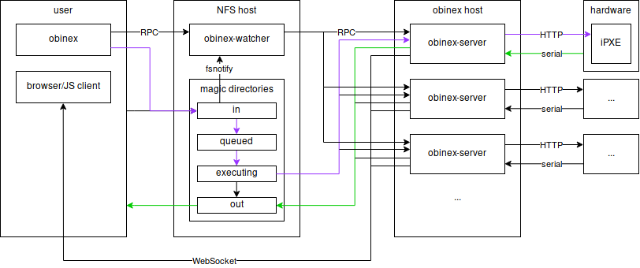

Schedule automatic binary execution on hardwareboxes.

# Usage
This section describes the file system interface for obinex. There is also a
command line tool at `/proj/i4obinex/system/bin/obinex`. For documentation
simply run it without arguments.

## Watchdir
The watchdir is the base directory for all obinex file system interactions. For
the default setup, this is `/proj/i4obinex/`. There you will find one
subdirectory for each hardwarebox. Within that directory you will find the
following four directories:

- `in/`: Putting a binary here, will schedule it for execution on this
   hardwarebox.

- `queued/`: If no lock is set or the lock is yours, the new binary will be moved
  here. It will be put into a directory that contains the binary name and a
  timestamp in its name. Normally, ther is no need to run any command but `ls`
  on this dir.

- `executing/`: The timestamped directory is moved here, as soon as it can be
  submitted for execution. A new file `output.txt` will be created and filled
  with the binaries output. This is also an `ls`-only directory.

- `out/`: Once execution has finished, the directory, including the original
  binary and its output, can be found here.

Subdirectories created in `in/` are mirrored in the other directories. It is a
good idea to create a dir `in/myname/`, to have an independent workspace.

## Locking
It is possible to lock each hardware box for exclusive use by you. All queued
binaries will be executed but no new binaries will be scheduled.

To lock a box, simply create the file `in/lock`, containing a timestamp
(rfc3339) of when the lock should expire. You can do this using the lock command
of obinex or by running

    date --rfc-3339=seconds -d <date> >in/lock

To unlock, simply run `rm in/lock`.

## Bootmodes
You can change bootmode by writing the mode to `in/mode` (or using the obinex
command). See `obinex -h` for more information and valid modes.

# Internals
## Architecture
Below you can see the overall architecture of the system. Violet and green show
typical paths for a binary and its output.

